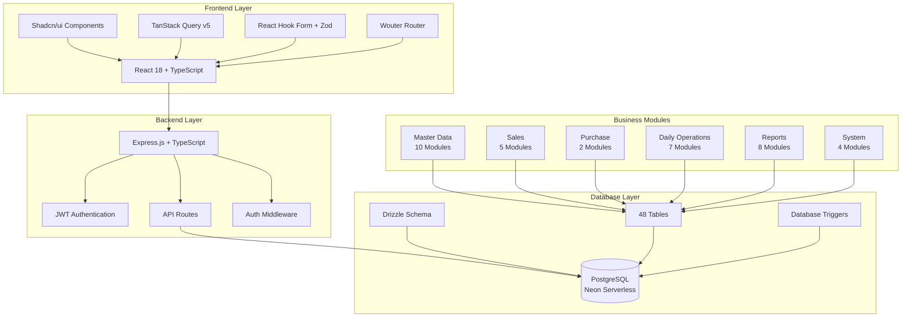
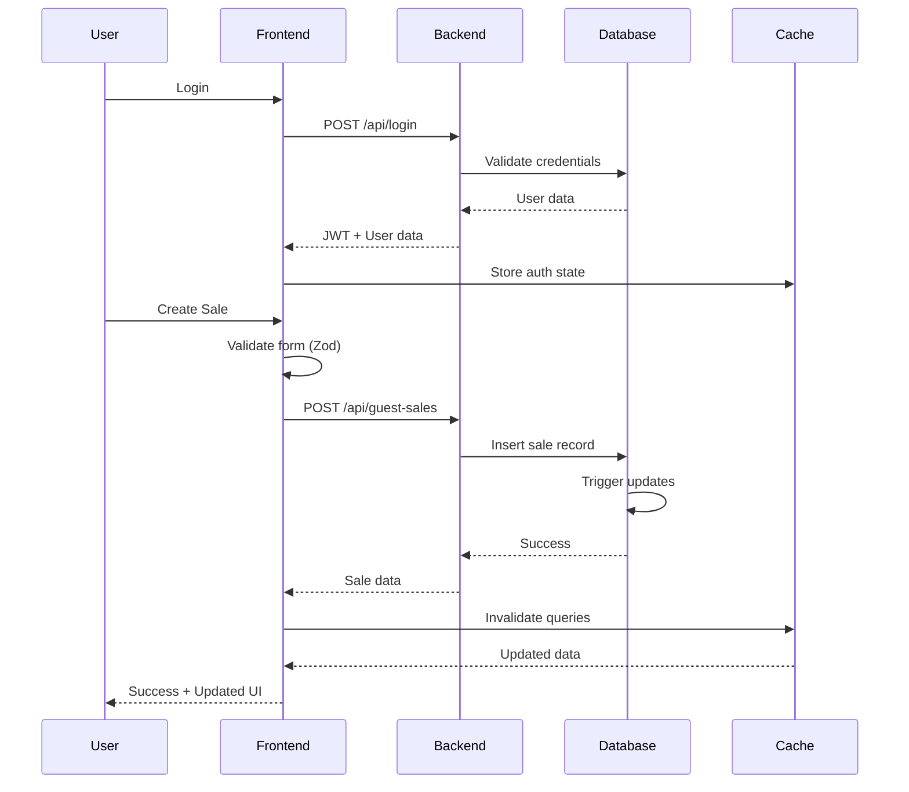
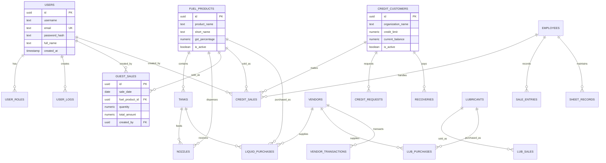
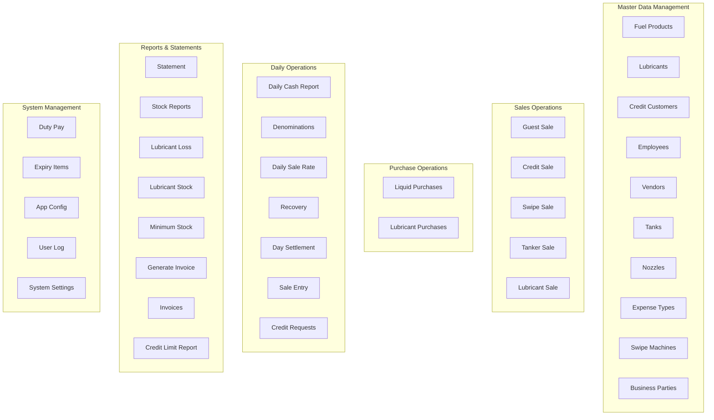
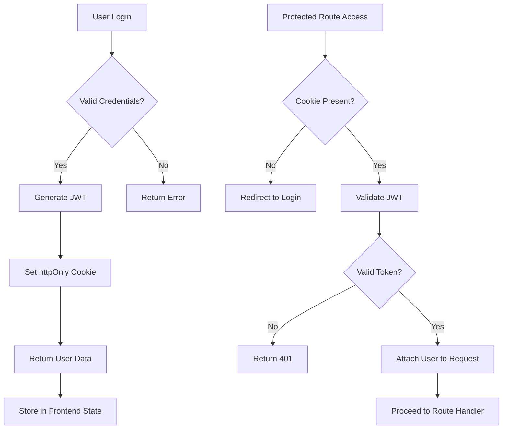
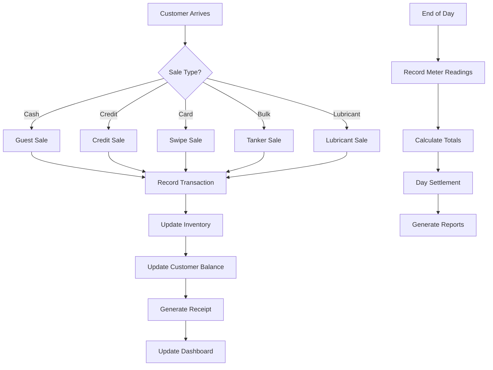
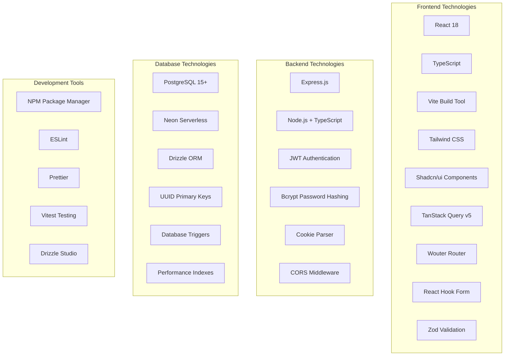
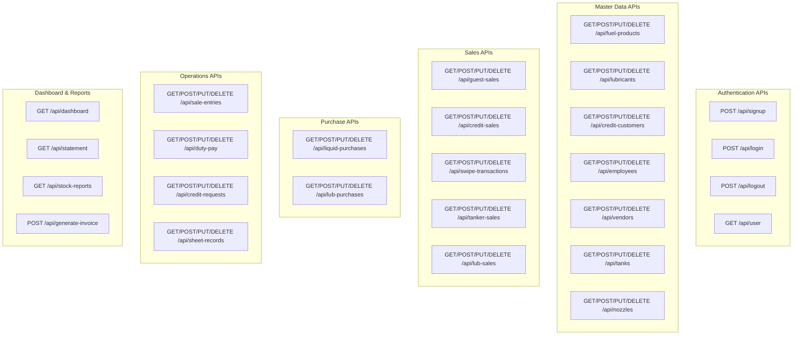

# 🏗️ System Architecture Diagram

## High-Level System Architecture



## Data Flow Architecture



## Database Entity Relationships



## Module Organization



## Authentication Flow



## Cache Invalidation Strategy

```mermaid
graph LR
    A[User Action] --> B[Mutation]
    B --> C[API Call]
    C --> D[Database Update]
    D --> E[Response]
    E --> F[Cache Invalidation]
    F --> G[Query Refetch]
    G --> H[UI Update]
    
    subgraph "Cache Keys"
        I[/api/fuel-products]
        J[/api/credit-sales]
        K[/api/dashboard]
        L[/api/credit-customers]
    end
    
    F --> I
    F --> J
    F --> K
    F --> L
```

## Business Process Flow



## Technology Stack Details



## API Endpoint Organization



---

**These diagrams provide a comprehensive visual understanding of the PetroPal system architecture, data flows, and business processes.**
